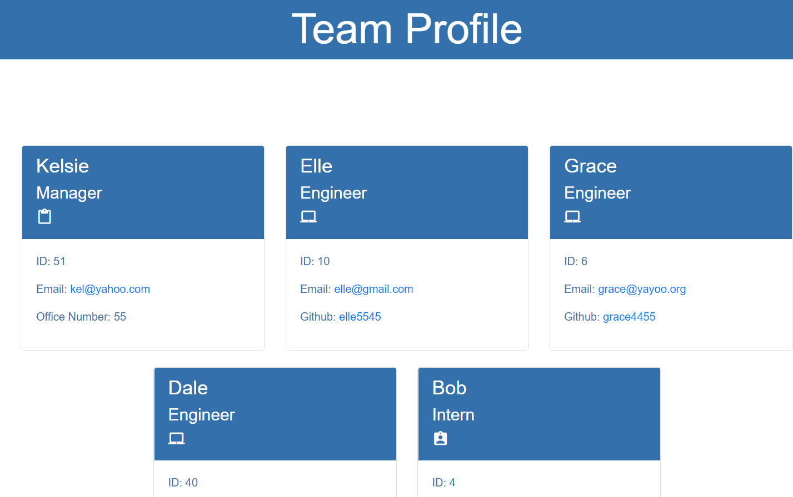

# TeamProfileGenerator

## Description 
This Team Profile Generator allows users to create a Team Profile, using the Inquirer package to display information on a newly generated html page, with simple styling. The project also demonstrates testing using Jest. 
 
## Table of Contents
* [Installation](#installation)
* [Usage](#usage)
* [License](#license)
* [Contributing](#contributing)
* [Tests](#tests)
* [Questions](#questions)

## Installation 
With the Repository the user should 1st install Node. And then the FS,Inquirer packages. For testing use Jest. 

## Usage 
Inquirer with Command line, Prompt and answer questions about thier project.
Video demo - [Screencastify](https://drive.google.com/file/d/1k20fEGA5xjXGrMuaATUmjHa_XM-ZP_VD/view) 

## License 
Licensed under MIT

## Contributing 
Users should refer to the Installation Section. 

## Tests
 Run Jest for tests on the Constructors. 

## Questions
 Any questions ? Email me at kelsie51@hotmail.com, Github URL for project at https://kelsie51.github.io/TeamProfileGenerator/dist/
